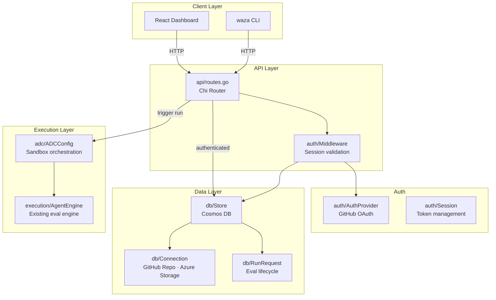
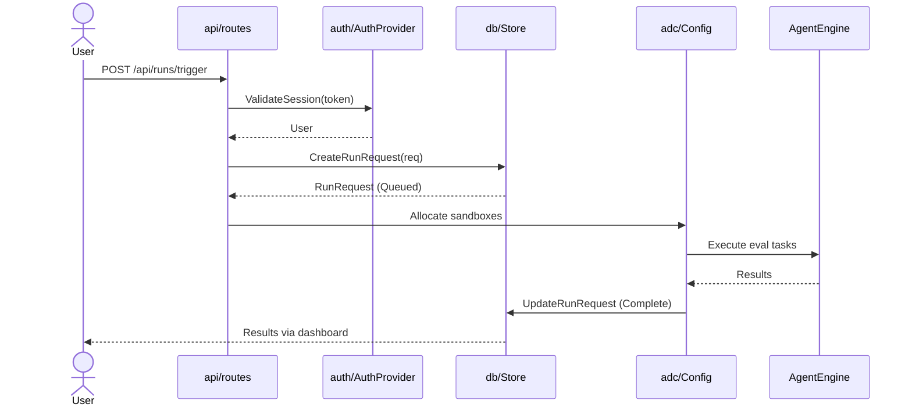

# Platform Module — `internal/platform/`

The platform module contains the server-side contracts for Waza Platform, a hosted
PaaS that evolves `waza serve` into a multi-tenant web application. These packages
define the interfaces that backend implementations build against.

## Architecture

## Packages

| Package | Purpose | Key Types |
|---------|---------|-----------|
| `auth`  | GitHub OAuth, sessions, HTTP middleware | `AuthProvider`, `User`, `Session`, `Middleware` |
| `db`    | Data persistence contracts (Cosmos DB) | `Store`, `Connection`, `RunRequest` |
| `api`   | HTTP route registration and handler stubs | `RegisterRoutes` |
| `adc`   | Azure Dev Compute sandbox configuration | `ADCConfig`, defaults |

## Design Principles

1. **Interface-first.** Every package exports interfaces, not implementations. Linus
   wires up the concrete Cosmos/GitHub/ADC backends against these contracts.
2. **Single-user isolation.** No team/org model in v1. Every resource is scoped to a
   `UserID`. Team sharing is a v2 concern.
3. **BYOS (Bring Your Own Storage).** Users connect their own Azure Storage account
   for eval artifacts. Waza stores only metadata.
4. **Quota enforcement.** ADC sandbox limits (max 10 per user) are encoded as
   constants, not config. Changing them requires a code change and review.

## Data Flow — Eval Run

